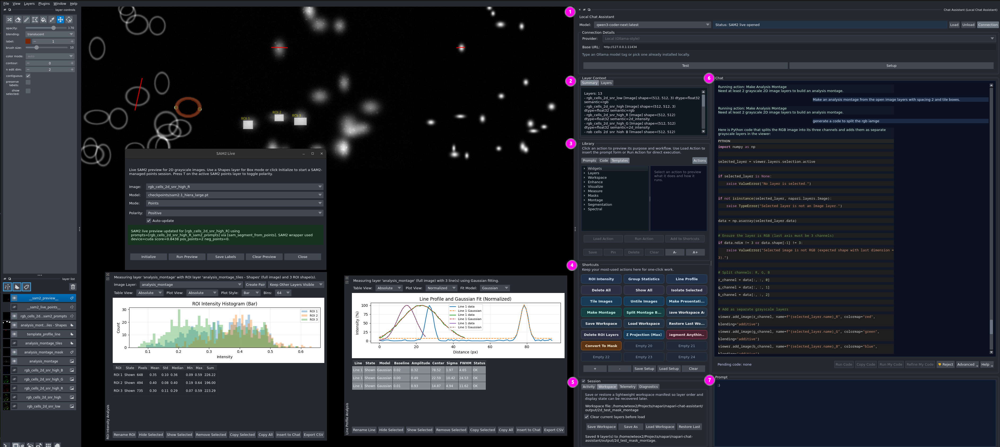

# napari-chat-assistant

[](https://github.com/wulinteousa2-hash/napari-chat-assistant/raw/main/LICENSE)
[](https://pypi.org/project/napari-chat-assistant)
[](https://python.org)
[](https://napari-hub.org/plugins/napari-chat-assistant)

Local, Ollama-powered AI and deterministic workbench for napari image-analysis workflows.

`napari-chat-assistant` adds a dock widget inside napari that understands the active viewer session, runs built-in image-analysis actions, generates executable napari Python code when a request goes beyond the current toolset, and lets users promote repeatable tasks into one-click shortcuts.

The goal is not to bolt a generic chatbot onto a viewer. The goal is to turn napari into a more practical analysis workspace for people who work with microscopy and other large multidimensional imaging datasets, especially users who want local AI help, reproducible workflows, direct control over their data, and fewer clicks per task.

## What's New In 2.1.0

Version `2.1.0` is a larger feature release because the plugin now gives users a faster way to control the viewer from natural language, reusable templates, or direct one-click actions.

The major addition is `Quick Controls` in both the `Templates` library and `Actions`. Instead of opening napari menus or writing code for common viewer setup, users can type a short prompt or run the matching action. With a layer selected, users can copy and try:

```text
Hide all layers except the selected layer.
```

The release also adds safe multi-step viewer workflows, so a prompt can run several viewer-control steps in order. With a layer selected, users can copy and try:

```text
1. Fit visible layers to view.
2. Show viewer axes.
3. Show scale bar.
4. Show selected layer bounding box.
5. Show selected layer name overlay.
```

Users can also say `undo last workflow` to restore the viewer-control state from before the previous quick-control workflow.

Other improvements in this release include expanded Quick Controls templates, a better `What can you do with my current layers?` getting-started prompt, stronger `Atlas Stitch` source/export options, and local repair for the common invalid SciPy import `gaussian_noise`.

For complete release history, see [CHANGELOG.md](CHANGELOG.md).

## Who It Is For

This plugin is built for:
- imaging core facility users
- researchers, staff scientists, and students working with imaging data
- teachers and educators running imaging demos or training sessions
- It is also designed for users who prefer to describe analysis goals in natural language instead of memorizing commands or writing scripts.

It is especially useful when you:
- inspect large 2D or 3D image data in napari
- move between interactive viewing, measurement, and Python-based analysis
- want a local open-weight model instead of a cloud service
- need to save, reuse, restore, and teach common imaging workflows
- want fast deterministic actions and one-click shortcuts for repeated tasks

## Why It Is Different

This plugin is built from practical imaging workflow needs, not from the idea of putting a generic chatbot beside a viewer.

It is designed around how work actually happens in napari:
- start from the data already open in the viewer
- inspect layers, objects, and regions of interest
- run the next analysis step through chat, actions, templates, shortcuts, or code
- review the result directly in the same session
- save useful workflows for later reuse

The assistant is grounded in the live napari session. It can inspect loaded layers, use ROI context, run built-in analysis actions, generate or refine viewer-bound Python when needed, and support deterministic one-click workflows through `Actions` and `Shortcuts`. The result is closer to an imaging workbench than a chat panel.

## Interaction Model

The plugin now supports a deliberate spectrum of interaction styles:
- `Prompt`: AI-first natural language requests
- `Code`: direct viewer-bound Python for users who want exact control
- `Templates`: reusable examples and built-in starting points
- `Actions`: deterministic built-in functions that can be run directly
- `Shortcuts`: user-defined one-click action buttons for repeated daily work

This is now a core design principle of the plugin: reduce how many clicks and how much time it takes for a user to complete a task.

## Interface Overview



The main dock is organized into a small number of practical work areas:

1. `Connection and model controls`
   Select the local model, monitor status, and manage the backend connection.

2. `Layer Context`
   Review the active workspace layers and insert exact layer names into prompts or code.

3. `Library`
   Browse reusable `Prompts`, `Code`, `Templates`, and deterministic `Actions`.

4. `Shortcuts`
   Keep your most-used actions as one-click buttons for repeated work.

5. `Session`
   Save or restore workspace state and access activity, telemetry, and diagnostics.

6. `Chat`
   See the assistant transcript, generated code, and direct action feedback in one place.

7. `Prompt`
   Enter natural language requests or paste Python for `Run My Code` and `Refine My Code`.

## What You Can Do

Current workflows include:
- inspect the selected layer or named layers with structured summaries
- review live layer context and insert exact layer names into prompts or code
- run built-in tools for enhancement, thresholding, binary mask cleanup, measurement, projection, cropping, montage, presentation, and layer visibility control
- add non-destructive annotation overlays, including free text, particle labels, callout labels with leader lines, and boxed titles above the image
- use deterministic `Actions` for common workflows without depending on prompt phrasing
- build and save your own `Shortcuts` layouts for repeated one-click work
- inspect ROI context and measure or extract values from `Labels`, `Shapes`, and line-based workflows
- use interactive analysis widgets such as `ROI Intensity Analysis`, `Line Profile Analysis`, and `Group Comparison Statistics`
- access SAM2 setup, live preview, box prompting, points prompting, and mask refinement from the same workbench
- browse built-in prompt templates, code templates, and learning templates for plugin workflows, teaching, and model testing
- generate napari Python code when no built-in tool is the right fit
- paste and run your own viewer-bound Python from the prompt box with `Run My Code`
- repair or explain broken pasted Python with `Refine My Code`
- save, pin, tag, rename, and reuse prompts and code from the local Library
- use built-in synthetic data generators for repeatable testing, teaching, and workflow development
- learn from built-in content for microscopy, electron microscopy, imaging physics, quantitative imaging, statistics, academic prompting, and language support
- save and restore workspace state with a JSON manifest plus OME-Zarr assets for generated image and labels data
- use `Atlas Stitch` from the advanced menu for specialized stitching and export workflows

Example requests:
- `Inspect the selected layer`
- `Preview threshold on the selected image`
- `Apply gaussian blur to the selected image with sigma 1.2`
- `Remove small objects from the selected mask with min_size 64`
- `Run watershed on the selected mask`
- `Measure labels table for the selected labels layer`
- `Annotate template_blob_labels with particle 1 to 4`
- `Annotate template_blob_labels using publication-style callout labels with leader lines.`
- `Add title WT Group N=10 above the image on the left`
- `Inspect the current ROI`
- `Extract ROI values from the selected image using the current ROI`
- `Open ROI intensity analysis`
- `Initialize a SAM2 points prompt layer for the selected image`
- `Write napari code to plot object area by condition`

## Local-First By Design

The assistant runs on local open-weight models through Ollama:
- no API key required
- no cloud dependency
- no internet requirement during normal use
- no image data leaves your workstation

This makes it a better fit for research and facility environments where users want privacy, controllability, and local reproducibility.

## Installation

Requirements:
- Python 3.9+
- napari
- Ollama running locally
- one local Ollama model, such as `nemotron-cascade-2:30b`

Install Ollama and start the server:

macOS and Linux:

```bash
curl -fsSL https://ollama.com/install.sh | sh
ollama serve
```

Windows:
- download and install Ollama from `https://ollama.com/download/windows`
- start the Ollama application or service

```bash
ollama pull nemotron-cascade-2:30b
```

Optional model alternatives:

```bash
ollama pull gpt-oss:120b
ollama pull qwen3-coder-next:latest
ollama pull qwen3.5
ollama pull qwen2.5:7b
```

Install the plugin:

```bash
pip install napari-chat-assistant
```

Development install:

```bash
git clone https://github.com/wulinteousa2-hash/napari-chat-assistant.git
cd napari-chat-assistant
pip install -e .
```

The plugin does not bundle Ollama or model weights. Larger models may require substantial RAM or VRAM.

## Usage

1. Start napari.
2. Open `Plugins -> Chat Assistant`.
3. Leave `Base URL` as `http://127.0.0.1:11434` unless your Ollama server is elsewhere.
4. Choose a model from the `Model` dropdown or type a model tag manually.
5. Use `Load` if you want to warm the selected model before the first request.
6. Start chatting, or use the Library for repeatable tasks and reusable code.

The assistant works best when prompts describe a concrete action. If you already have Python code, paste it into the Prompt box and use `Run My Code`. If pasted code fails or needs adaptation to the current viewer, use `Refine My Code`.

Examples:
- `Inspect the selected layer`
- `Preview threshold on em_2d_snr_mid`
- `Apply gaussian denoise to em_2d_snr_low with sigma 1.2`
- `Fill holes in mask_messy_2d`
- `Remove small objects from mask_messy_2d with min_size 64`
- `Measure labels table for rgb_cells_2d_labels`
- `Annotate template_blob_labels with publication-style callout labels`
- `Create a max intensity projection from em_3d_snr_mid along axis 0`
- `Crop em_2d_snr_high to the bounding box of em_2d_mask with padding 8`
- `Extract ROI values from em_2d_snr_mid using em_2d_mask`
- `Prepare this viewer for image review`
- `Undo last workflow`

## Core Workflow

1. Open your image or volume in napari.
2. Use `Layer Context` to inspect loaded layers or insert exact layer names into the Prompt box.
3. Ask for a concrete action, or browse `Actions` when you want deterministic execution.
4. Use `Templates` for reusable prompt/code examples and `Shortcuts` for repeated one-click workflows.
5. Use generated code, `Run My Code`, or `Refine My Code` when a task needs custom Python.
6. Save useful prompts, code snippets, workspace state, and shortcut layouts for later reuse.

This keeps inspection, analysis, code review, and workflow reuse close to the current napari session.

## Synthetic Data Templates

Use the Library `Templates > Data` area or built-in code snippets to load repeatable synthetic datasets.

Current built-in synthetic generators include:
- Synthetic 2D SNR Sweep Gray
- Synthetic 3D SNR Sweep Gray
- Synthetic 2D SNR Sweep RGB
- Synthetic 3D SNR Sweep RGB
- messy masks 2D/3D

These create named layers so you can test built-in tools quickly without hunting for sample data. Labels layers from these synthetic datasets can also be used as ROIs for ROI inspection and value extraction.

## Feature Summary

Built-in workflows include:
- layer inspection and live layer-context insertion
- Quick Controls for fit view, zoom, 2D/3D mode, axes, scale bar, tooltips, overlays, grid view, and layer visibility
- enhancement, thresholding, mask cleanup, connected components, labels measurement, projection, cropping, montage, and presentation helpers
- ROI inspection and value extraction from `Labels`, `Shapes`, and line-based workflows
- annotation overlays, including free text, particle labels, callouts, and boxed titles
- workspace save/restore with a JSON manifest plus OME-Zarr assets for generated image and labels data
- deterministic `Actions`, reusable `Templates`, and user-defined `Shortcuts`
- optional advanced workflows such as SAM2 and Atlas Stitch

### Code generation workflows

When a request is not covered by a built-in tool, the assistant can return napari Python code instead of forcing the wrong tool.

Generated code can be:
- copied to the clipboard
- reviewed in chat
- executed from the plugin
- repaired or explained in place when you use `Refine My Code` on pasted or failed user code

You can also paste your own Python directly into the Prompt box and run it from the plugin with `Run My Code`, without switching to QtConsole.

Use assistant-generated code when you want a reusable script or need custom logic beyond the current built-in tools.

Use `Run My Code` when you already have Python you want to test quickly inside the current napari session.

Use `Refine My Code` when your own code fails validation, errors at runtime, or needs adjustment to the current napari viewer state.

## Library, Actions, And Shortcuts

The Library stores repeatable prompts, code snippets, templates, and deterministic actions.

Useful behavior:
- single click loads a prompt or code snippet into the editor
- double click sends a prompt or runs a code snippet
- templates can be previewed, loaded, or run
- actions can be previewed, run, or added to `Shortcuts`
- saved and recent prompts/code can be renamed, tagged, pinned, or cleared
- shortcuts can be arranged, saved, loaded, and reused across sessions

This is now part of the core product direction: keep AI available, but let mature workflows become fast, button-driven, and reusable.

## Optional Integrations

If `napari-nd2-spectral-ome-zarr` is installed, the assistant can open:
- the ND2-to-OME-Zarr export widget
- the Spectral Viewer widget
- the Spectral Analysis widget

This lets chat act as an entry point for Nikon ND2 conversion and spectral workflows without rebuilding those UIs inside this plugin.

Install links:
- GitHub: `https://github.com/wulinteousa2-hash/napari-nd2-spectral-ome-zarr`
- napari Hub: `https://napari-hub.org/plugins/napari-nd2-spectral-ome-zarr.html`

### Experimental SAM2

Behavior:
- SAM2 is accessed from `Advanced`, not from the main toolbar
- `SAM2 Setup` is always available from `Advanced`
- `SAM2 Live` stays disabled until the backend is configured and passes readiness checks
- the rest of the assistant remains usable even if SAM2 is not configured

Current setup expects:
- a working Python environment that already includes the dependencies required by SAM2
- an external SAM2 project path
- a valid checkpoint path
- a valid config path

`napari-chat-assistant` now ships its own bundled SAM2 adapter in
`napari_chat_assistant.integrations.sam2_adapter`, so users only need the SAM2 repo,
checkpoint, and config files in the normal places.

The `SAM2 Setup` dialog now includes:
- `Auto Detect` to scan common local clone locations and fill likely project, checkpoint, and config paths
- `Setup Help` for short setup commands and field tips

Minimal install:

```bash
git clone https://github.com/facebookresearch/sam2.git && cd sam2
pip install -e .
```

Typical setup flow:
1. Start napari from the environment that contains your SAM2 dependencies.
2. Open `Plugins -> Chat Assistant`.
3. Open `Advanced -> SAM2 Setup`.
4. Click `Auto Detect` first.
5. Confirm or edit the SAM2 project path, checkpoint path, config path, and device.
6. Click `Test`.
7. Save the settings.
8. Open `Advanced -> SAM2 Live` when the backend reports ready.

## How It Works

The assistant is designed to operate within constrained napari workflows rather than as a general-purpose chatbot.

The current strategy is:
1. collect structured napari viewer context
2. build deterministic per-layer profile objects from the current viewer state
3. add bounded approved session memory when available
4. send that context and the user request to a local Ollama model
5. the model returns a structured JSON response that specifies either:
   - a normal reply
   - a built-in tool call
   - generated Python code
6. run the selected registry-backed tool or expose the generated code through the UI
7. update session memory from explicit user feedback or successful follow-up behavior

This keeps the assistant more grounded than a plain chat interface and makes common operations more reliable.

Current viewer state and explicit user clarification remain the primary source of truth. Session memory is selective and secondary, not a full transcript memory system.

## Recommended Models

For a broader list of models tested during development, see [docs/tested_models.md](docs/tested_models.md).

Good starting choices:
- `nemotron-cascade-2:30b`
- `gpt-oss:120b`
- `qwen3-coder-next:latest`
- `qwen3.5`
- `gemma4:e4b`

`nemotron-cascade-2:30b` is the current default. Larger models may improve reasoning or code generation but require more RAM or VRAM; smaller tags are better for constrained systems.

## Current Limitations

- the dataset profiler is still Phase 1 and remains strongest on already-loaded napari layers rather than reader- or file-format-specific workflows
- TIFF vs OME-Zarr adapter behavior is not implemented yet
- ND2 and Zeiss reader-aware adapters are not implemented in this plugin
- the tool registry is in progress; some tools are now registry-backed, but the migration is not complete yet
- session memory is selective and bounded; it is not full conversation memory
- model output can still be inconsistent, especially when falling back to generated code
- some requests still miss built-in tools and fall through to code generation when a stronger built-in workflow would be preferable
- generated code can still fail if the model invents incorrect napari APIs or unsupported imports
- no image attachment or multimodal input pipeline yet
- performance optimization for very large 2D/3D datasets is still in progress
- hard native crashes in Qt/C-extension code may not be captured cleanly by the plugin crash log even when normal plugin errors are logged

Most reliable current workflow:
- use built-in tools for common layer inspection and mask/image actions
- trust current viewer context and current layer profiles over any remembered prior turn
- use the Library for repeated prompts, demo packs, and reusable code
- use generated code when you want explicit review and control
- use `Run My Code` when you already have working Python and want to test it directly inside napari

For demo and education workflows:
- ask for code that uses the current napari `viewer`
- avoid prompts that create a second `napari.Viewer()` or call `napari.run()`
- prefer docked widgets over unmanaged popup windows for histogram or SNR teaching tools

## Troubleshooting

### Ollama not running

If `Test` fails after restarting your computer, Ollama is usually not running yet.

Start it in a terminal:

```bash
ollama serve
```

Then return to the plugin and click `Test` again.

### Pulling a model

Model downloads are intentionally handled outside the plugin.

To try a different model:
- browse tags at `https://ollama.com/search`
- type the tag into the plugin `Model` field if needed
- pull it in a terminal, for example:

```bash
ollama pull nemotron-cascade-2:30b
```

Then use `Test` to refresh the plugin state.

### Logs and crash logs

The plugin writes two local log files:
- `~/.napari-chat-assistant/assistant.log`
- `~/.napari-chat-assistant/crash.log`

Use these together with the terminal traceback when diagnosing crashes or unclear UI failures.

### Local model telemetry

If telemetry is enabled, the plugin writes lightweight local model events to:
- `~/.napari-chat-assistant/model_telemetry.jsonl`

Telemetry is opt-in from `Session -> Telemetry` and includes summary, log, and reset controls for advanced users.

Generated code is also preflight-validated before execution for common dtype mistakes, unsupported napari imports, and unavailable `viewer.*` APIs. When validation blocks execution, the code remains visible and copyable for review or regeneration.

## Release

This package is published to PyPI so napari Hub can discover it.

For maintainer release instructions and PyPI publishing setup, see [RELEASING.md](RELEASING.md).

## Development

Build a release artifact:

```bash
python -m build
```

## License

MIT.
